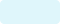
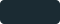
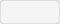
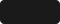

# GUI Functional Specification

This document describes the graphical user interface for MeshPrep, based on the high-level flow defined in `docs/functional_spec.md`.

## Overview

The GUI provides a step-by-step wizard interface for non-technical Windows users to repair STL files for 3D printing. It mirrors the CLI functionality with visual feedback, interactive editing, and real-time progress updates.

## Design Principles

1. **Progressive disclosure**: Show only relevant options at each step; advanced settings available on demand.
2. **Clear feedback**: Always show current state, progress, and next actions.
3. **Non-destructive by default**: Dry-run available before committing changes; originals never overwritten.
4. **Reproducibility**: Every run can be exported as a shareable package.
5. **Accessibility**: Large click targets, keyboard navigation, high-contrast text.

## Window Layout

```
+-------------------------------------------------------------------------+
|  Header: MeshPrep - [current step name]                            [?]  |
+----------------+--------------------------------------------------------+
|                |                                                        |
|  Step List     |  Main Content Area                                     |
|  (navigation)  |  (changes per step)                                    |
|                |                                                        |
|  1. Env        |                                                        |
|  2. Select     |                                                        |
|  3. Suggest    |                                                        |
|  4. Dry-Run    |                                                        |
|  5. Execute    |                                                        |
|  6. Results    |                                                        |
|                |                                                        |
+----------------+--------------------------------------------------------+
|  Global Log (collapsible)                                               |
+-------------------------------------------------------------------------+
|  Footer: Status bar | [Previous] [Next / Run]                           |
+-------------------------------------------------------------------------+
```

### Components

| Component | Purpose |
|-----------|---------|
| Header | App title, current step, help button |
| Step List | Sidebar navigation showing all steps; highlights current step; allows jumping to completed steps |
| Main Content Area | Step-specific UI (see per-step sections below) |
| Global Log | Scrollable log of all actions/events; can be collapsed |
| Footer | Status message, navigation buttons |

---

## Step 1: Environment Check

**Purpose**: Verify that all required tools and dependencies are installed.

### UI Elements

| Element | Type | Description |
|---------|------|-------------|
| Status Log | Multi-line text (read-only, scrollable) | Shows environment check output line by line |
| Auto-setup Button | Button | Attempts automatic setup (venv creation, pip install) |
| Manual Instructions Button | Button | Opens dialog or panel with copyable setup commands |
| Refresh Button | Button | Re-runs environment check |
| Status Indicator | Icon + label | Shows overall status: ✓ Ready, ⚠ Warnings, ✗ Missing dependencies |

### Behavior

1. On step entry, automatically run `checkenv` and stream results to Status Log.
2. If all required dependencies present, show ✓ Ready and enable Next.
3. If optional tools missing (e.g., Blender), show ⚠ with note; still allow Next.
4. If required dependencies missing, show ✗ and disable Next until resolved.
5. Auto-setup attempts:
   - Create `.venv` if not present
   - Run `pip install -r requirements.txt`
   - Stream output to Status Log
   - Re-check environment on completion
6. Manual Instructions shows a dialog with platform-specific commands (Windows CMD, PowerShell, conda) that can be copied.

### Validation

- Next enabled only when required dependencies are satisfied.

---

## Step 2: Model Selection / Filter Source Choice

**Purpose**: Select an STL file and choose whether to auto-detect profile or use an existing filter script.

### UI Elements

| Element | Type | Description |
|---------|------|-------------|
| File Path Label | Label | Shows selected file path or "No file selected" |
| Browse Button | Button | Opens file picker dialog for STL files |
| Drag-drop Zone | Panel | Accepts drag-and-drop of STL file |
| Filter Source Radio | Radio group | (A) Auto-detect profile, (B) Use existing filter script |
| Load Filter Button | Button | Opens file picker for JSON/YAML filter script |
| Paste Filter Button | Button | Opens dialog to paste filter script JSON/YAML |
| URL Input | Text field | Enter URL to download filter script (optional) |
| Filter Preview | Text area (read-only) | Shows loaded filter script summary |

### Behavior

1. User selects STL via Browse or drag-drop.
2. On file selection:
   - Validate file is readable STL (ASCII or binary).
   - Show file size and basic info in File Path Label.
   - If Auto-detect selected, enable Next to proceed to profile detection.
3. If "Use existing filter script" selected:
   - Enable Load/Paste/URL options.
   - On filter load, validate JSON/YAML schema.
   - Show filter name, action count, and source in Filter Preview.
   - If valid, enable Next to proceed to Review (skip profile detection).
4. If filter script invalid, show error and disable Next.

### Validation

- STL file must be selected and readable.
- If using existing filter script, it must pass schema validation.

---

## Step 3: Suggest Filter Script (Profile Detection)

**Purpose**: Analyze model, detect profile, and present suggested filter script for review/editing.

### UI Elements

| Element | Type | Description |
|---------|------|-------------|
| Diagnostics Panel | Text area (read-only) | Shows computed diagnostics (watertight, holes, components, etc.) |
| Profile Label | Label | Detected profile name + confidence score |
| Alternative Profiles | Dropdown or list | Top 2-3 alternative profiles if confidence < threshold |
| Explanation | Text area (read-only) | Short explanation of why this profile/filter was suggested |
| Actions List | List widget (editable) | Ordered list of filter actions |
| Add Action Button | Button | Add new action to list |
| Edit Action Button | Button | Edit selected action (name, params) |
| Remove Action Button | Button | Remove selected action |
| Move Up/Down Buttons | Buttons | Reorder actions |
| Save Preset Button | Button | Save current filter script as named preset |
| Export Button | Button | Export filter script to file |
| Import Button | Button | Import filter script from file (replaces current) |

### Behavior

1. On step entry (if auto-detect chosen), run model scan:
   - Compute diagnostics vector using `trimesh`.
   - Match to profile using rule engine.
   - Generate suggested filter script with metadata.
   - Populate Diagnostics Panel, Profile Label, Explanation, and Actions List.
2. If user chose existing filter script in Step 2, skip detection and show that script.
3. User can edit Actions List:
   - Add: prompt for action name (from registry) and params.
   - Edit: dialog for action name and params (JSON editor or form).
   - Remove: confirm and delete.
   - Reorder: move up/down.
4. Save Preset:
   - Prompt for name, author, description, tags.
   - Save to `filters/<name>.json`.
5. Export: save to user-specified path.
6. Import: load from file, validate, replace Actions List.

### Validation

- Actions List must have at least one action.
- All actions must be valid (known in registry, valid params).

---

## Step 4: Dry-Run Preview

**Purpose**: Simulate filter script execution without writing output; show intermediate diagnostics.

### UI Elements

| Element | Type | Description |
|---------|------|-------------|
| Steps Table | Table widget | Columns: Step, Action, Status, Diagnostics, Notes |
| Run Dry-Run Button | Button | Start simulation |
| Stop Button | Button | Abort dry-run |
| Progress Bar | Progress bar | Shows overall progress |
| Diagnostics Detail | Text area (read-only) | Shows detailed diagnostics for selected step |

### Behavior

1. On Run Dry-Run:
   - For each action in filter script:
     - Execute action in dry-run mode (no file writes).
     - Capture intermediate diagnostics.
     - Update Steps Table row with status (pending → running → ok/warn/error).
     - Populate Diagnostics Detail on row selection.
   - Show overall progress in Progress Bar.
2. If an action fails or produces warnings, highlight row and show details.
3. User can Stop at any time; partial results remain visible.
4. On completion, show summary: expected final state, any warnings.
5. User can return to Step 3 to edit filter script and re-run dry-run.

### Validation

- Dry-run is optional; user can skip to Execute if confident.

---

## Step 5: Execute

**Purpose**: Run the filter script for real; produce cleaned STL and reports.

### UI Elements

| Element | Type | Description |
|---------|------|-------------|
| Progress Bar | Progress bar | Overall progress |
| Terminal Log | Multi-line text (read-only, scrollable) | Real-time log output (styled like terminal) |
| Steps Table | Table widget | Columns: Step, Action, Status, Runtime, Notes |
| Start Button | Button | Begin execution |
| Stop Button | Button | Abort execution |
| Output Path Label | Label | Shows where output will be written |
| Browse Output Button | Button | Change output directory |

### Behavior

1. On step entry, show confirmation: "Ready to execute filter script. Output will be written to [path]. [Start]"
2. On Start:
   - Disable Start, enable Stop.
   - For each action:
     - Run action implementation.
     - Stream stdout/stderr to Terminal Log.
     - Update Steps Table row with status and runtime.
   - On completion, run validation checks.
   - If validation fails and Blender available and `--use-blender` is `on-failure`, prompt user to escalate.
3. On Stop:
   - Abort current action.
   - Mark remaining steps as "aborted".
   - Partial output may be written; warn user.
4. On success:
   - Show ✓ "Execution complete. Output written to [path]."
   - Enable Next to proceed to Results.
5. On failure:
   - Show ✗ "Execution failed at step [n]. See log for details."
   - Offer: "Retry", "Edit filter script", "View report".

### Validation

- Execution cannot proceed if previous steps incomplete.

---

## Step 6: Results & Export

**Purpose**: Show run summary, provide access to artifacts, and offer export/share options.

### UI Elements

| Element | Type | Description |
|---------|------|-------------|
| Summary Panel | Text area (read-only) | Overall status, runtime, key diagnostics |
| Artifacts List | List widget | Links to output STL, report.json, report.csv |
| Open Output Folder Button | Button | Opens output directory in file explorer |
| View Report Button | Button | Opens report.json in viewer/editor |
| Export Run Package Button | Button | Bundles input, filter script, report, thumbnails into shareable folder |
| Copy Reproduce Command Button | Button | Copies CLI command to reproduce this run |
| Save Preset Button | Button | Save (or update) filter script as named preset |
| Start New Run Button | Button | Reset wizard for new model |

### Behavior

1. On step entry, populate Summary Panel with:
   - Final status (success/failure).
   - Total runtime.
   - Key diagnostics: watertight_before, watertight_after, holes_filled, etc.
   - Filter script name and version.
2. Artifacts List shows clickable links to:
   - Cleaned STL file.
   - `report.json`.
   - `report.csv`.
   - Log file.
3. Export Run Package:
   - Prompt for destination folder.
   - Copy: input STL (or sample), filter script, report.json, before/after thumbnails, checkenv output.
   - Show confirmation with path.
4. Copy Reproduce Command:
   - Generate CLI command with all args.
   - Copy to clipboard.
   - Show toast: "Command copied to clipboard."
5. Save Preset:
   - If filter script was edited, prompt to save as new preset.
6. Start New Run:
   - Confirm discard current state.
   - Reset to Step 2 (keep environment state).

---

## Dialogs and Secondary Windows

### Action Editor Dialog

| Element | Type | Description |
|---------|------|-------------|
| Action Name | Dropdown | Select from registered actions |
| Action Description | Label | Shows action documentation |
| Parameters Form | Dynamic form | Fields for each param based on action schema |
| Timeout | Number input | Optional timeout override |
| On Error | Dropdown | `abort`, `skip`, `continue` |
| OK / Cancel | Buttons | Confirm or discard |

### Save Preset Dialog

| Element | Type | Description |
|---------|------|-------------|
| Preset Name | Text input | Required |
| Author | Text input | Optional |
| Description | Text area | Optional |
| Tags | Text input (comma-separated) | Optional |
| Save Location | Label + Browse | Defaults to `filters/` |
| Save / Cancel | Buttons | Confirm or discard |

### Manual Setup Instructions Dialog

| Element | Type | Description |
|---------|------|-------------|
| Platform Tabs | Tab bar | Windows CMD, PowerShell, conda |
| Commands | Text area (read-only, selectable) | Platform-specific commands |
| Copy All Button | Button | Copy commands to clipboard |
| Close | Button | Close dialog |

### Blender Escalation Prompt

| Element | Type | Description |
|---------|------|-------------|
| Message | Label | "Primary repairs failed. Escalate to Blender for advanced repair?" |
| Details | Text area | Shows which checks failed |
| Yes / No | Buttons | Proceed or skip escalation |

---

## Keyboard Shortcuts

| Shortcut | Action |
|----------|--------|
| `Ctrl+O` | Open/select STL file |
| `Ctrl+S` | Save preset |
| `Ctrl+E` | Export filter script |
| `Ctrl+R` | Run (dry-run or execute, context-dependent) |
| `Ctrl+L` | Toggle global log visibility |
| `F1` | Open help |
| `Escape` | Cancel current operation / close dialog |
| `Enter` | Confirm dialog / proceed to next step |

---

## Error Handling and User Feedback

### Error Types and Responses

| Error | User Feedback | Recovery |
|-------|---------------|----------|
| STL load failure | "Could not load file. Ensure it is a valid STL." | Allow retry or select different file |
| Filter script parse error | "Invalid filter script. Check JSON/YAML syntax." | Show line/column if possible; allow edit |
| Unknown action | "Action 'X' not found in registry." | Highlight in Actions List; suggest removal or update |
| Action execution error | "Action 'X' failed: [error message]" | Log details; offer retry, skip, or abort |
| Validation failure | "Model did not pass validation: [reasons]" | Show diagnostics; suggest next steps (edit filter, escalate) |
| Environment incomplete | "Missing: [packages]. Run Auto-setup or see instructions." | Enable Auto-setup; show manual steps |

### Toast Notifications

- Success: green bar, auto-dismiss after 3s.
- Warning: yellow bar, auto-dismiss after 5s.
- Error: red bar, persists until dismissed.

---

## Settings Panel (accessible via menu or gear icon)

| Setting | Type | Default | Description |
|---------|------|---------|-------------|
| Output Directory | Path picker | `./output/` | Default output location |
| Blender Path | Path picker | Auto-detect | Path to Blender executable |
| Use Blender | Dropdown | `on-failure` | `always`, `on-failure`, `never` |
| Theme | Dropdown | `dark` | `dark`, `light`, `system` |
| Log Level | Dropdown | `info` | `debug`, `info`, `warning`, `error` |
| Auto-save Presets | Checkbox | false | Save edited filter scripts automatically |
| Check for Updates | Checkbox | true | Check for new versions on startup |

---

## Theming

### Dark Theme (default)

| Element | Color | Preview |
|---------|-------|:-------:|
| Background | `#0f1720` |  |
| Panel | `#111822` |  |
| Accent | `#4fe8c4` |  |
| Text | `#dff6fb` |  |
| Button | `#1b2b33` |  |
| Error | `#ff6b6b` |  |
| Warning | `#ffd93d` |  |
| Success | `#6bff6b` |  |

### Light Theme

| Element | Color | Preview |
|---------|-------|:-------:|
| Background | `#f5f5f5` |  |
| Panel | `#ffffff` |  |
| Accent | `#00a67d` |  |
| Text | `#1a1a1a` |  |
| Button | `#e0e0e0` |  |
| Error | `#d32f2f` |  |
| Warning | `#f57c00` |  |
| Success | `#388e3c` |  |

### Color Combination Samples

These SVG samples demonstrate how the theme colors work together in typical UI contexts.

#### Dark Theme Sample - Button States

```svg
<svg xmlns="http://www.w3.org/2000/svg" width="400" height="120" viewBox="0 0 400 120">
  <!-- Background -->
  <rect width="400" height="120" fill="#0f1720"/>
  
  <!-- Panel -->
  <rect x="10" y="10" width="380" height="100" rx="8" fill="#111822"/>
  
  <!-- Normal Button -->
  <rect x="20" y="30" width="100" height="36" rx="4" fill="#1b2b33"/>
  <text x="70" y="54" font-family="Segoe UI" font-size="14" fill="#dff6fb" text-anchor="middle">Normal</text>
  
  <!-- Accent Button -->
  <rect x="140" y="30" width="100" height="36" rx="4" fill="#4fe8c4"/>
  <text x="190" y="54" font-family="Segoe UI" font-size="14" fill="#0f1720" text-anchor="middle">Accent</text>
  
  <!-- Success Button -->
  <rect x="260" y="30" width="100" height="36" rx="4" fill="#6bff6b"/>
  <text x="310" y="54" font-family="Segoe UI" font-size="14" fill="#0f1720" text-anchor="middle">Success</text>
  
  <!-- Status indicators -->
  <circle cx="45" cy="90" r="8" fill="#6bff6b"/>
  <text x="60" y="94" font-family="Segoe UI" font-size="12" fill="#dff6fb">Ready</text>
  
  <circle cx="145" cy="90" r="8" fill="#ffd93d"/>
  <text x="160" y="94" font-family="Segoe UI" font-size="12" fill="#dff6fb">Warning</text>
  
  <circle cx="255" cy="90" r="8" fill="#ff6b6b"/>
  <text x="270" y="94" font-family="Segoe UI" font-size="12" fill="#dff6fb">Error</text>
</svg>
```

#### Dark Theme Sample - Step Navigation

```svg
<svg xmlns="http://www.w3.org/2000/svg" width="200" height="280" viewBox="0 0 200 280">
  <!-- Background -->
  <rect width="200" height="280" fill="#0f1720"/>
  
  <!-- Panel -->
  <rect x="10" y="10" width="180" height="260" rx="8" fill="#111822"/>
  
  <!-- Title -->
  <text x="20" y="40" font-family="Segoe UI" font-size="16" fill="#4fe8c4" font-weight="bold">Steps</text>
  
  <!-- Step 1 - Completed -->
  <rect x="20" y="55" width="160" height="32" rx="4" fill="#1b2b33"/>
  <circle cx="38" cy="71" r="10" fill="#6bff6b"/>
  <text x="36" y="75" font-family="Segoe UI" font-size="12" fill="#0f1720" text-anchor="middle">✓</text>
  <text x="55" y="76" font-family="Segoe UI" font-size="13" fill="#dff6fb">1. Environment</text>
  
  <!-- Step 2 - Active -->
  <rect x="20" y="95" width="160" height="32" rx="4" fill="#4fe8c4" opacity="0.2"/>
  <rect x="20" y="95" width="160" height="32" rx="4" fill="none" stroke="#4fe8c4" stroke-width="2"/>
  <circle cx="38" cy="111" r="10" fill="#4fe8c4"/>
  <text x="38" y="115" font-family="Segoe UI" font-size="12" fill="#0f1720" text-anchor="middle">2</text>
  <text x="55" y="116" font-family="Segoe UI" font-size="13" fill="#4fe8c4">2. Select Model</text>
  
  <!-- Step 3 - Pending -->
  <rect x="20" y="135" width="160" height="32" rx="4" fill="#1b2b33"/>
  <circle cx="38" cy="151" r="10" fill="#1b2b33" stroke="#dff6fb" stroke-width="1" opacity="0.5"/>
  <text x="38" y="155" font-family="Segoe UI" font-size="12" fill="#dff6fb" text-anchor="middle" opacity="0.5">3</text>
  <text x="55" y="156" font-family="Segoe UI" font-size="13" fill="#dff6fb" opacity="0.5">3. Suggest Filter</text>
  
  <!-- Step 4 - Pending -->
  <rect x="20" y="175" width="160" height="32" rx="4" fill="#1b2b33"/>
  <circle cx="38" cy="191" r="10" fill="#1b2b33" stroke="#dff6fb" stroke-width="1" opacity="0.5"/>
  <text x="38" y="195" font-family="Segoe UI" font-size="12" fill="#dff6fb" text-anchor="middle" opacity="0.5">4</text>
  <text x="55" y="196" font-family="Segoe UI" font-size="13" fill="#dff6fb" opacity="0.5">4. Dry-Run</text>
  
  <!-- Step 5 - Pending -->
  <rect x="20" y="215" width="160" height="32" rx="4" fill="#1b2b33"/>
  <circle cx="38" cy="231" r="10" fill="#1b2b33" stroke="#dff6fb" stroke-width="1" opacity="0.5"/>
  <text x="38" y="235" font-family="Segoe UI" font-size="12" fill="#dff6fb" text-anchor="middle" opacity="0.5">5</text>
  <text x="55" y="236" font-family="Segoe UI" font-size="13" fill="#dff6fb" opacity="0.5">5. Execute</text>
</svg>
```

#### Dark Theme Sample - Log Output

```svg
<svg xmlns="http://www.w3.org/2000/svg" width="500" height="180" viewBox="0 0 500 180">
  <!-- Background -->
  <rect width="500" height="180" fill="#0f1720"/>
  
  <!-- Panel -->
  <rect x="10" y="10" width="480" height="160" rx="8" fill="#111822"/>
  
  <!-- Title bar -->
  <rect x="10" y="10" width="480" height="28" rx="8" fill="#1b2b33"/>
  <rect x="10" y="30" width="480" height="8" fill="#1b2b33"/>
  <text x="20" y="30" font-family="Segoe UI" font-size="12" fill="#4fe8c4">Global Log</text>
  
  <!-- Log entries -->
  <text x="20" y="60" font-family="Consolas" font-size="12" fill="#dff6fb">[INFO] Starting environment check...</text>
  <text x="20" y="80" font-family="Consolas" font-size="12" fill="#6bff6b">[OK] Python 3.11.4 detected</text>
  <text x="20" y="100" font-family="Consolas" font-size="12" fill="#6bff6b">[OK] trimesh 4.0.5 installed</text>
  <text x="20" y="120" font-family="Consolas" font-size="12" fill="#6bff6b">[OK] pymeshfix 0.16.3 installed</text>
  <text x="20" y="140" font-family="Consolas" font-size="12" fill="#ffd93d">[WARN] Blender not found (optional)</text>
  <text x="20" y="160" font-family="Consolas" font-size="12" fill="#4fe8c4">[INFO] Environment ready</text>
</svg>
```

#### Light Theme Sample - Button States

```svg
<svg xmlns="http://www.w3.org/2000/svg" width="400" height="120" viewBox="0 0 400 120">
  <!-- Background -->
  <rect width="400" height="120" fill="#f5f5f5"/>
  
  <!-- Panel -->
  <rect x="10" y="10" width="380" height="100" rx="8" fill="#ffffff" stroke="#e0e0e0"/>
  
  <!-- Normal Button -->
  <rect x="20" y="30" width="100" height="36" rx="4" fill="#e0e0e0"/>
  <text x="70" y="54" font-family="Segoe UI" font-size="14" fill="#1a1a1a" text-anchor="middle">Normal</text>
  
  <!-- Accent Button -->
  <rect x="140" y="30" width="100" height="36" rx="4" fill="#00a67d"/>
  <text x="190" y="54" font-family="Segoe UI" font-size="14" fill="#ffffff" text-anchor="middle">Accent</text>
  
  <!-- Success Button -->
  <rect x="260" y="30" width="100" height="36" rx="4" fill="#388e3c"/>
  <text x="310" y="54" font-family="Segoe UI" font-size="14" fill="#ffffff" text-anchor="middle">Success</text>
  
  <!-- Status indicators -->
  <circle cx="45" cy="90" r="8" fill="#388e3c"/>
  <text x="60" y="94" font-family="Segoe UI" font-size="12" fill="#1a1a1a">Ready</text>
  
  <circle cx="145" cy="90" r="8" fill="#f57c00"/>
  <text x="160" y="94" font-family="Segoe UI" font-size="12" fill="#1a1a1a">Warning</text>
  
  <circle cx="255" cy="90" r="8" fill="#d32f2f"/>
  <text x="270" y="94" font-family="Segoe UI" font-size="12" fill="#1a1a1a">Error</text>
</svg>
```

#### Dark Theme Sample - Full Window Mockup

```svg
<svg xmlns="http://www.w3.org/2000/svg" width="700" height="400" viewBox="0 0 700 400">
  <!-- Window Background -->
  <rect width="700" height="400" fill="#0f1720"/>
  
  <!-- Header -->
  <rect x="0" y="0" width="700" height="50" fill="#111822"/>
  <text x="20" y="32" font-family="Segoe UI" font-size="18" fill="#4fe8c4" font-weight="bold">MeshPrep</text>
  <text x="120" y="32" font-family="Segoe UI" font-size="14" fill="#dff6fb">- Select Model</text>
  <rect x="650" y="12" width="30" height="26" rx="4" fill="#1b2b33"/>
  <text x="665" y="30" font-family="Segoe UI" font-size="14" fill="#dff6fb" text-anchor="middle">?</text>
  
  <!-- Sidebar -->
  <rect x="0" y="50" width="180" height="300" fill="#111822"/>
  
  <!-- Step items -->
  <rect x="10" y="60" width="160" height="36" rx="4" fill="#1b2b33"/>
  <circle cx="30" cy="78" r="8" fill="#6bff6b"/>
  <text x="45" y="82" font-family="Segoe UI" font-size="12" fill="#dff6fb">1. Environment</text>
  
  <rect x="10" y="105" width="160" height="36" rx="4" fill="#4fe8c4" opacity="0.15"/>
  <rect x="10" y="105" width="160" height="36" rx="4" fill="none" stroke="#4fe8c4" stroke-width="2"/>
  <circle cx="30" cy="123" r="8" fill="#4fe8c4"/>
  <text x="45" y="127" font-family="Segoe UI" font-size="12" fill="#4fe8c4">2. Select Model</text>
  
  <rect x="10" y="150" width="160" height="36" rx="4" fill="#1b2b33" opacity="0.5"/>
  <text x="45" y="172" font-family="Segoe UI" font-size="12" fill="#dff6fb" opacity="0.5">3. Suggest Filter</text>
  
  <rect x="10" y="195" width="160" height="36" rx="4" fill="#1b2b33" opacity="0.5"/>
  <text x="45" y="217" font-family="Segoe UI" font-size="12" fill="#dff6fb" opacity="0.5">4. Dry-Run</text>
  
  <rect x="10" y="240" width="160" height="36" rx="4" fill="#1b2b33" opacity="0.5"/>
  <text x="45" y="262" font-family="Segoe UI" font-size="12" fill="#dff6fb" opacity="0.5">5. Execute</text>
  
  <rect x="10" y="285" width="160" height="36" rx="4" fill="#1b2b33" opacity="0.5"/>
  <text x="45" y="307" font-family="Segoe UI" font-size="12" fill="#dff6fb" opacity="0.5">6. Results</text>
  
  <!-- Main Content -->
  <rect x="190" y="60" width="500" height="240" rx="8" fill="#111822"/>
  
  <!-- File selection area -->
  <text x="210" y="90" font-family="Segoe UI" font-size="14" fill="#dff6fb">Select STL File</text>
  <rect x="210" y="100" width="460" height="60" rx="4" fill="#1b2b33" stroke="#4fe8c4" stroke-dasharray="4"/>
  <text x="440" y="135" font-family="Segoe UI" font-size="12" fill="#dff6fb" text-anchor="middle" opacity="0.7">Drag and drop STL file here or click to browse</text>
  
  <!-- Radio buttons -->
  <circle cx="220" cy="190" r="8" fill="none" stroke="#4fe8c4" stroke-width="2"/>
  <circle cx="220" cy="190" r="4" fill="#4fe8c4"/>
  <text x="235" y="194" font-family="Segoe UI" font-size="12" fill="#dff6fb">Auto-detect profile and suggest filter</text>
  
  <circle cx="220" cy="220" r="8" fill="none" stroke="#dff6fb" stroke-width="1" opacity="0.5"/>
  <text x="235" y="224" font-family="Segoe UI" font-size="12" fill="#dff6fb" opacity="0.7">Use existing filter script</text>
  
  <!-- Load filter button -->
  <rect x="210" y="250" width="120" height="32" rx="4" fill="#1b2b33" opacity="0.5"/>
  <text x="270" y="270" font-family="Segoe UI" font-size="12" fill="#dff6fb" text-anchor="middle" opacity="0.5">Load Filter</text>
  
  <!-- Global Log -->
  <rect x="0" y="350" width="700" height="50" fill="#111822"/>
  <text x="20" y="375" font-family="Consolas" font-size="11" fill="#6bff6b">[OK] Environment ready</text>
  <text x="200" y="375" font-family="Consolas" font-size="11" fill="#dff6fb">| Waiting for model selection...</text>
  
  <!-- Footer Navigation -->
  <rect x="500" y="310" width="80" height="32" rx="4" fill="#1b2b33"/>
  <text x="540" y="330" font-family="Segoe UI" font-size="12" fill="#dff6fb" text-anchor="middle">Previous</text>
  
  <rect x="590" y="310" width="80" height="32" rx="4" fill="#1b2b33" opacity="0.5"/>
  <text x="630" y="330" font-family="Segoe UI" font-size="12" fill="#dff6fb" text-anchor="middle" opacity="0.5">Next</text>
</svg>
```

---

### Color Palette Summary

#### Dark Theme Palette

```
+------------------+------------------+------------------+------------------+
|    Background    |      Panel       |      Accent      |       Text       |
|     #0f1720      |     #111822      |     #4fe8c4      |     #dff6fb      |
+------------------+------------------+------------------+------------------+
|      Button      |      Error       |     Warning      |     Success      |
|     #1b2b33      |     #ff6b6b      |     #ffd93d      |     #6bff6b      |
+------------------+------------------+------------------+------------------+
```

#### Contrast Ratios (WCAG compliance)

| Foreground | Background | Ratio | WCAG AA | WCAG AAA |
|------------|------------|-------|---------|----------|
| Text (#dff6fb) | Background (#0f1720) | 12.5:1 | ✓ Pass | ✓ Pass |
| Text (#dff6fb) | Panel (#111822) | 11.2:1 | ✓ Pass | ✓ Pass |
| Text (#dff6fb) | Button (#1b2b33) | 8.9:1 | ✓ Pass | ✓ Pass |
| Accent (#4fe8c4) | Background (#0f1720) | 9.8:1 | ✓ Pass | ✓ Pass |
| Error (#ff6b6b) | Panel (#111822) | 5.2:1 | ✓ Pass | ✗ Fail |
| Warning (#ffd93d) | Panel (#111822) | 10.1:1 | ✓ Pass | ✓ Pass |
| Success (#6bff6b) | Panel (#111822) | 10.8:1 | ✓ Pass | ✓ Pass |

---

## Accessibility

- All interactive elements have keyboard focus indicators.
- Screen reader labels for all buttons and controls.
- Minimum contrast ratio 4.5:1 for text.
- Resizable window; content reflows appropriately.
- Tooltips on hover for all buttons and icons.

---

## State Persistence

- On close, save:
  - Last used output directory.
  - Window size and position.
  - Global log visibility state.
  - Recent files list (last 5).
- On startup, restore above state.
- Filter scripts in progress are NOT auto-saved to avoid accidental overwrites.

---

## Future Enhancements (out of scope for v1)

- 3D model preview panel (render STL before/after).
- Batch mode UI (select multiple files, run same filter).
- Plugin/extension manager for custom actions.
- Cloud sync for presets.
- Undo/redo for filter script edits.

---

## Mapping to CLI

| GUI Action | CLI Equivalent |
|------------|----------------|
| Select STL | `--input <file>` |
| Use preset | `--preset <name>` |
| Load filter script | `--filter <file>` |
| Set output dir | `--output <dir>` |
| Dry-run | `--dry-run` |
| Execute | (default) |
| Export run package | `--export-run <dir>` |
| Verbose logging | `--verbose` |
| Blender escalation | `--use-blender <choice>` |

---

## Implementation Notes

- Built with PySide6 (Qt for Python).
- Stacked widget for step navigation.
- Background threads for long operations (env check, dry-run, execute) with signals to update UI.
- Filter script editing uses a simple JSON editor or form-based approach.
- Action registry loaded from `config/actions.json` or Python module.
- Presets stored as JSON files in `filters/` directory.

---

## References

- `docs/functional_spec.md` — high-level flow and requirements
- `docs/model_profiles.md` — profile definitions and detection heuristics
- `docs/INSTALL.md` — installation instructions (to be created)
- `CONTRIBUTING.md` — contribution workflow (to be created)
