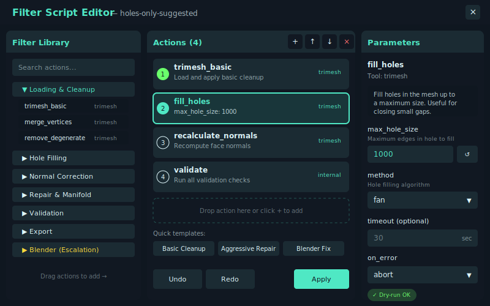
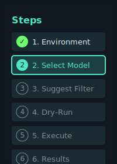
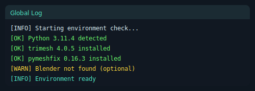
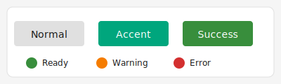
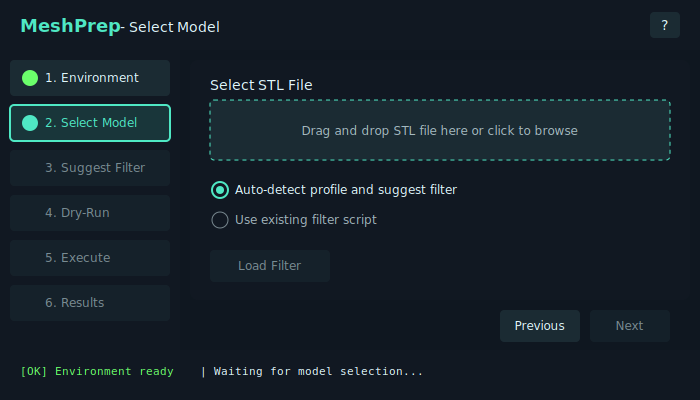

# GUI Functional Specification

This document describes the graphical user interface for MeshPrep, based on the high-level flow defined in `docs/functional_spec.md`.

## Overview

The GUI provides a step-by-step wizard interface for non-technical Windows users to repair STL files for 3D printing. It mirrors the CLI functionality with visual feedback, interactive editing, and real-time progress updates.

## Design Principles

1. **Progressive disclosure**: Show only relevant options at each step; advanced settings available on demand.
2. **Clear feedback**: Always show current state, progress, and next actions.
3. **Non-destructive by default**: Dry-run available before committing changes; originals never overwritten.
4. **Reproducibility**: Every run can be exported as a shareable package.
5. **Accessibility**: Large click targets, keyboard navigation, high-contrast text.

## Window Layout

```
+-------------------------------------------------------------------------+
|  Header: MeshPrep - [current step name]                            [?]  |
+----------------+--------------------------------------------------------+
|                |                                                        |
|  Step List     |  Main Content Area                                     |
|  (navigation)  |  (changes per step)                                    |
|                |                                                        |
|  1. Env        |                                                        |
|  2. Select     |                                                        |
|  3. Review     |                                                        |
|  4. Execute    |                                                        |
|  5. Results    |                                                        |
|                |                                                        |
+----------------+--------------------------------------------------------+
|  Global Log (collapsible)                                               |
+-------------------------------------------------------------------------+
|  Footer: Status bar | [Previous] [Next / Run]                           |
+-------------------------------------------------------------------------+
```

### Components

| Component | Purpose |
|-----------|---------|
| Header | App title, current step, help button |
| Step List | Sidebar navigation showing all steps; highlights current step; allows jumping to completed steps |
| Main Content Area | Step-specific UI (see per-step sections below) |
| Global Log | Scrollable log of all actions/events; can be collapsed |
| Footer | Status message, navigation buttons |

---

## Filter Script Editor

The Filter Script Editor is a dedicated window/panel for building and modifying filter scripts. It provides an intuitive drag-and-drop interface with a comprehensive filter library.

### Editor Layout



The editor is divided into three panels:

| Panel | Width | Purpose |
|-------|-------|----------|
| Filter Library | ~25% | Browsable catalog of all available actions, organized by category |
| Action List | ~45% | The current filter script's ordered list of actions |
| Parameter Editor | ~30% | Edit parameters for the selected action |

### Filter Library Panel

| Element | Type | Description |
|---------|------|-------------|
| Search Box | Text input | Filter actions by name or keyword |
| Category List | Collapsible tree | Categories: Cleanup, Hole Filling, Normals, Repair, Simplification, Validation, Export, Blender |
| Action Items | Draggable list items | Each shows action name and tool source (trimesh, pymeshfix, blender) |
| Tool Filter | Toggle buttons | Filter by tool: All, trimesh, pymeshfix, meshio, blender |

### Action List Panel

| Element | Type | Description |
|---------|------|-------------|
| Action Cards | Draggable cards | Numbered cards showing action name, brief description, and tool badge |
| Add Button (+) | Button | Open action picker to insert new action |
| Move Up/Down | Buttons | Reorder selected action |
| Delete Button (×) | Button | Remove selected action |
| Drop Zone | Visual indicator | Shows where dragged action will be inserted |
| Template Buttons | Button group | Quick-insert common action sequences |
| Undo/Redo | Buttons | Undo/redo editor changes |
| Apply Button | Button | Save changes and close editor |

### Parameter Editor Panel

| Element | Type | Description |
|---------|------|-------------|
| Action Name | Label | Name of selected action |
| Tool Badge | Badge | Source tool (trimesh, pymeshfix, etc.) |
| Description | Text block | What the action does and when to use it |
| Parameter Fields | Dynamic form | Input controls appropriate to each parameter type |
| Reset Button (↺) | Button | Reset parameter to default value |
| Timeout | Number input | Optional timeout override in seconds |
| On Error | Dropdown | Error handling: abort, skip, continue |
| Dry-run Badge | Badge | Shows if action supports dry-run simulation |

### Parameter Input Types

| Parameter Type | Input Control | Example |
|----------------|---------------|----------|
| `float` | Number input with optional slider | `eps: 1e-8` |
| `int` | Number input (integer only) | `max_hole_size: 1000` |
| `bool` | Checkbox | `ascii: false` |
| `string` | Text input | `path: "output.stl"` |
| `enum` | Dropdown | `method: "fan"` |
| `path` | Text input + Browse button | `tool_mesh: "subtract.stl"` |

### Editor Behavior

1. **Opening the editor**:
   - From Step 3 (Suggest Filter Script): Click "Edit" or double-click the Actions List.
   - From menu: Tools → Filter Script Editor.
   - Editor opens as a modal dialog or docked panel.

2. **Adding actions**:
   - Drag from Filter Library and drop into Action List at desired position.
   - Double-click an action in the library to append to the end.
   - Click (+) button and select from a searchable dropdown.

3. **Editing actions**:
   - Click an action card to select it; parameters appear in the right panel.
   - Modify parameters using the appropriate input controls.
   - Changes are reflected immediately in the action card summary.

4. **Reordering actions**:
   - Drag action cards up/down within the list.
   - Use Move Up/Down buttons for keyboard-accessible reordering.

5. **Removing actions**:
   - Select action and click Delete (×) or press Delete key.
   - Confirm removal if action has modified parameters.

6. **Using templates**:
   - Click a template button (e.g., "Basic Cleanup") to insert a predefined sequence.
   - Templates can be inserted at the current position or replace all actions.

7. **Validation**:
   - Invalid parameters show red border and error tooltip.
   - Actions with missing required parameters are highlighted.
   - "Apply" button disabled until all validation errors resolved.

8. **Applying changes**:
   - Click "Apply" to save changes and close the editor.
   - Click "Cancel" or press Escape to discard changes.
   - If unsaved changes exist, prompt for confirmation before closing.

### Quick Templates

| Template | Actions Included |
|----------|------------------|
| Basic Cleanup | `trimesh_basic` → `merge_vertices` → `remove_degenerate_faces` → `validate` |
| Hole Fill + Normals | `fill_holes` → `recalculate_normals` → `validate` |
| Aggressive Repair | `pymeshfix_repair` → `fill_holes` → `remove_small_components` → `fix_normals` → `validate` |
| Blender Fix | `blender_remesh` → `blender_boolean_union` → `blender_triangulate` → `validate` → `export_stl` |
| Simplify | `decimate` → `smooth_taubin` → `validate` |

### Keyboard Shortcuts (Editor)

| Shortcut | Action |
|----------|--------|
| `Ctrl+Z` | Undo |
| `Ctrl+Y` | Redo |
| `Delete` | Remove selected action |
| `Ctrl+D` | Duplicate selected action |
| `Ctrl+↑` | Move action up |
| `Ctrl+↓` | Move action down |
| `Ctrl+F` | Focus search box |
| `Enter` | Apply changes (when Apply button focused) |
| `Escape` | Cancel and close editor |

### Filter Library Categories

The library organizes 60+ actions into these categories:

| Category | Actions | Description |
|----------|---------|-------------|
| Loading & Cleanup | 7 | Load files, merge vertices, remove degenerates |
| Hole Filling | 3 | Fill holes, cap boundaries |
| Normal Correction | 5 | Recalculate, reorient, unify, flip normals |
| Component Management | 5 | Remove small parts, keep largest, boolean union |
| Repair & Manifold | 5 | Fix non-manifold, stitch boundaries, pymeshfix |
| Simplification & Remeshing | 6 | Decimate, subdivide, smooth, remesh |
| Geometry Analysis | 4 | Identify thin regions, offset, hollow |
| Boolean & Intersections | 4 | Detect/fix self-intersections, boolean ops |
| Validation & Diagnostics | 7 | Check watertight, manifold, normals, volume |
| Export | 5 | Export to STL, OBJ, PLY, 3MF |
| Blender (Escalation) | 6 | Blender-specific remesh, solidify, boolean |

See `docs/functional_spec.md` for the complete action catalog with parameters.

## Step 1: Environment Check

**Purpose**: Verify that all required tools and dependencies are installed.

### UI Elements

| Element | Type | Description |
|---------|------|-------------|
| Status Log | Multi-line text (read-only, scrollable) | Shows environment check output line by line |
| Auto-setup Button | Button | Attempts automatic setup (venv creation, pip install) |
| Manual Instructions Button | Button | Opens dialog or panel with copyable setup commands |
| Refresh Button | Button | Re-runs environment check |
| Status Indicator | Icon + label | Shows overall status: ✓ Ready, ⚠ Warnings, ✗ Missing dependencies |

### Behavior

1. On step entry, automatically run `checkenv` and stream results to Status Log.
2. If all required dependencies present, show ✓ Ready and enable Next.
3. If optional tools missing (e.g., Blender), show ⚠ with note; still allow Next.
4. If required dependencies missing, show ✗ and disable Next until resolved.
5. Auto-setup attempts:
   - Create `.venv` if not present
   - Run `pip install -r requirements.txt`
   - Stream output to Status Log
   - Re-check environment on completion
6. Manual Instructions shows a dialog with platform-specific commands (Windows CMD, PowerShell, conda) that can be copied.

### Validation

- Next enabled only when required dependencies are satisfied.

---

## Step 2: Model Selection / Filter Source Choice

**Purpose**: Select an STL file and choose whether to auto-detect profile or use an existing filter script.

### UI Elements

| Element | Type | Description |
|---------|------|-------------|
| File Path Label | Label | Shows selected file path or "No file selected" |
| Browse Button | Button | Opens file picker dialog for STL files |
| Drag-drop Zone | Panel | Accepts drag-and-drop of STL file |
| Filter Source Radio | Radio group | (A) Auto-detect profile, (B) Use existing filter script |
| Load Filter Button | Button | Opens file picker for JSON/YAML filter script |
| Paste Filter Button | Button | Opens dialog to paste filter script JSON/YAML |
| URL Input | Text field | Enter URL to download filter script (optional) |
| Filter Preview | Text area (read-only) | Shows loaded filter script summary |

### Behavior

1. User selects STL via Browse or drag-drop.
2. On file selection:
   - Validate file is readable STL (ASCII or binary).
   - Show file size and basic info in File Path Label.
   - If Auto-detect selected, enable Next to proceed to profile detection.
3. If "Use existing filter script" selected:
   - Enable Load/Paste/URL options.
   - On filter load, validate JSON/YAML schema.
   - Show filter name, action count, and source in Filter Preview.
   - If valid, enable Next to proceed to Review (skip profile detection).
4. If filter script invalid, show error and disable Next.

### Validation

- STL file must be selected and readable.
- If using existing filter script, it must pass schema validation.

---

## Step 3: Review Filter Script

**Purpose**: Review the suggested filter script before execution.

### UI Elements

| Element | Type | Description |
|---------|------|-------------|
| Diagnostics Panel | Text area (read-only) | Shows computed diagnostics (watertight, holes, components, etc.) |
| Profile Label | Label | Detected profile name + confidence score |
| Alternative Profiles | Dropdown or list | Top 2-3 alternative profiles if confidence < threshold |
| Explanation | Text area (read-only) | Short explanation of why this profile/filter was suggested |
| Actions List | List widget (editable) | Ordered list of filter actions |
| Add Action Button | Button | Add new action to list |
| Edit Action Button | Button | Edit selected action (name, params) |
| Remove Action Button | Button | Remove selected action |
| Move Up/Down Buttons | Buttons | Reorder actions |
| Save Preset Button | Button | Save current filter script as named preset |
| Export Button | Button | Export filter script to file |
| Import Button | Button | Import filter script from file (replaces current) |

### Behavior

1. On step entry (if auto-detect chosen), run model scan:
   - Compute diagnostics vector using `trimesh`.
   - Match to profile using rule engine.
   - Generate suggested filter script with metadata.
   - Populate Diagnostics Panel, Profile Label, Explanation, and Actions List.
2. If user chose existing filter script in Step 2, skip detection and show that script.
3. User can edit Actions List:
   - Add: prompt for action name (from registry) and params.
   - Edit: dialog for action name and params (JSON editor or form).
   - Remove: confirm and delete.
   - Reorder: move up/down.
4. Save Preset:
   - Prompt for name, author, description, tags.
   - Save to `filters/<name>.json`.
5. Export: save to user-specified path.
6. Import: load from file, validate, replace Actions List.

### Validation

- Actions List must have at least one action.
- All actions must be valid (known in registry, valid params).

---

## Step 4: Execute

**Purpose**: Run the filter script for real; produce cleaned STL and reports.

### UI Elements

| Element | Type | Description |
|---------|------|-------------|
| Progress Bar | Progress bar | Overall progress |
| Terminal Log | Multi-line text (read-only, scrollable) | Real-time log output (styled like terminal) |
| Steps Table | Table widget | Columns: Step, Action, Status, Runtime, Notes |
| Start Button | Button | Begin execution |
| Stop Button | Button | Abort execution |
| Output Path Label | Label | Shows where output will be written |
| Browse Output Button | Button | Change output directory |

### Behavior

1. On step entry, show confirmation: "Ready to execute filter script. Output will be written to [path]. [Start]"
2. On Start:
   - Disable Start, enable Stop.
   - For each action:
     - Run action implementation.
     - Stream stdout/stderr to Terminal Log.
     - Update Steps Table row with status and runtime.
   - On completion, run validation checks.
   - If validation fails and Blender available and `--use-blender` is `on-failure`, prompt user to escalate.
3. On Stop:
   - Abort current action.
   - Mark remaining steps as "aborted".
   - Partial output may be written; warn user.
4. On success:
   - Show ✓ "Execution complete. Output written to [path]."
   - Enable Next to proceed to Results.
5. On failure:
   - Show ✗ "Execution failed at step [n]. See log for details."
   - Offer: "Retry", "Edit filter script", "View report".

### Validation

- Execution cannot proceed if previous steps incomplete.

---

## Step 5: Results & Export

**Purpose**: Show run summary, provide access to artifacts, and offer export/share options.

### UI Elements

| Element | Type | Description |
|---------|------|-------------|
| Summary Panel | Text area (read-only) | Overall status, runtime, key diagnostics |
| Artifacts List | List widget | Links to output STL, report.json, report.csv |
| Open Output Folder Button | Button | Opens output directory in file explorer |
| View Report Button | Button | Opens report.json in viewer/editor |
| Export Run Package Button | Button | Bundles input, filter script, report, thumbnails into shareable folder |
| Copy Reproduce Command Button | Button | Copies CLI command to reproduce this run |
| Save Preset Button | Button | Save (or update) filter script as named preset |
| Start New Run Button | Button | Reset wizard for new model |

### Behavior

1. On step entry, populate Summary Panel with:
   - Final status (success/failure).
   - Total runtime.
   - Key diagnostics: watertight_before, watertight_after, holes_filled, etc.
   - Filter script name and version.
2. Artifacts List shows clickable links to:
   - Cleaned STL file.
   - `report.json`.
   - `report.csv`.
   - Log file.
3. Export Run Package:
   - Prompt for destination folder.
   - Copy: input STL (or sample), filter script, report.json, before/after thumbnails, checkenv output.
   - Show confirmation with path.
4. Copy Reproduce Command:
   - Generate CLI command with all args.
   - Copy to clipboard.
   - Show toast: "Command copied to clipboard."
5. Save Preset:
   - If filter script was edited, prompt to save as new preset.
6. Start New Run:
   - Confirm discard current state.
   - Reset to Step 2 (keep environment state).

---

## Dialogs and Secondary Windows

### Action Editor Dialog

| Element | Type | Description |
|---------|------|-------------|
| Action Name | Dropdown | Select from registered actions |
| Action Description | Label | Shows action documentation |
| Parameters Form | Dynamic form | Fields for each param based on action schema |
| Timeout | Number input | Optional timeout override |
| On Error | Dropdown | `abort`, `skip`, `continue` |
| OK / Cancel | Buttons | Confirm or discard |

### Save Preset Dialog

| Element | Type | Description |
|---------|------|-------------|
| Preset Name | Text input | Required |
| Author | Text input | Optional |
| Description | Text area | Optional |
| Tags | Text input (comma-separated) | Optional |
| Save Location | Label + Browse | Defaults to `filters/` |
| Save / Cancel | Buttons | Confirm or discard |

### Manual Setup Instructions Dialog

| Element | Type | Description |
|---------|------|-------------|
| Platform Tabs | Tab bar | Windows CMD, PowerShell, conda |
| Commands | Text area (read-only, selectable) | Platform-specific commands |
| Copy All Button | Button | Copy commands to clipboard |
| Close | Button | Close dialog |

### Blender Escalation Prompt

| Element | Type | Description |
|---------|------|-------------|
| Message | Label | "Primary repairs failed. Escalate to Blender for advanced repair?" |
| Details | Text area | Shows which checks failed |
| Yes / No | Buttons | Proceed or skip escalation |

---

## Keyboard Shortcuts

| Shortcut | Action |
|----------|--------|
| `Ctrl+O` | Open/select STL file |
| `Ctrl+S` | Save preset |
| `Ctrl+E` | Export filter script |
| `Ctrl+R` | Run (dry-run or execute, context-dependent) |
| `Ctrl+L` | Toggle global log visibility |
| `F1` | Open help |
| `Escape` | Cancel current operation / close dialog |
| `Enter` | Confirm dialog / proceed to next step |

---

## Error Handling and User Feedback

### Error Types and Responses

| Error | User Feedback | Recovery |
|-------|---------------|----------|
| STL load failure | "Could not load file. Ensure it is a valid STL." | Allow retry or select different file |
| Filter script parse error | "Invalid filter script. Check JSON/YAML syntax." | Show line/column if possible; allow edit |
| Unknown action | "Action 'X' not found in registry." | Highlight in Actions List; suggest removal or update |
| Action execution error | "Action 'X' failed: [error message]" | Log details; offer retry, skip, or abort |
| Validation failure | "Model did not pass validation: [reasons]" | Show diagnostics; suggest next steps (edit filter, escalate) |
| Environment incomplete | "Missing: [packages]. Run Auto-setup or see instructions." | Enable Auto-setup; show manual steps |

### Toast Notifications

- Success: green bar, auto-dismiss after 3s.
- Warning: yellow bar, auto-dismiss after 5s.
- Error: red bar, persists until dismissed.

---

## Settings Panel (accessible via menu or gear icon)

| Setting | Type | Default | Description |
|---------|------|---------|-------------|
| Output Directory | Path picker | `./output/` | Default output location |
| Blender Path | Path picker | Auto-detect | Path to Blender executable |
| Use Blender | Dropdown | `on-failure` | `always`, `on-failure`, `never` |
| Theme | Dropdown | `dark` | `dark`, `light`, `system` |
| Log Level | Dropdown | `info` | `debug`, `info`, `warning`, `error` |
| Auto-save Presets | Checkbox | false | Save edited filter scripts automatically |
| Check for Updates | Checkbox | true | Check for new versions on startup |

---

## Theming

### Dark Theme (default)

| Element | Color | Preview |
|---------|-------|:-------:|
| Background | `#0f1720` |  |
| Panel | `#111822` |  |
| Accent | `#4fe8c4` |  |
| Text | `#dff6fb` |  |
| Button | `#1b2b33` |  |
| Error | `#ff6b6b` |  |
| Warning | `#ffd93d` |  |
| Success | `#6bff6b` |  |

### Light Theme

| Element | Color | Preview |
|---------|-------|:-------:|
| Background | `#f5f5f5` |  |
| Panel | `#ffffff` |  |
| Accent | `#00a67d` |  |
| Text | `#1a1a1a` |  |
| Button | `#e0e0e0` |  |
| Error | `#d32f2f` |  |
| Warning | `#f57c00` |  |
| Success | `#388e3c` |  |

### Color Combination Samples

These mockups demonstrate how the theme colors work together in typical UI contexts.

#### Dark Theme - Button States


#### Dark Theme - Step Navigation



#### Dark Theme - Log Output



#### Light Theme - Button States



#### Dark Theme - Full Window Mockup



---

### Color Palette Summary

#### Dark Theme Palette

```
+------------------+------------------+------------------+------------------+
|    Background    |      Panel       |      Accent      |       Text       |
|     #0f1720      |     #111822      |     #4fe8c4      |     #dff6fb      |
+------------------+------------------+------------------+------------------+
|      Button      |      Error       |     Warning      |     Success      |
|     #1b2b33      |     #ff6b6b      |     #ffd93d      |     #6bff6b      |
+------------------+------------------+------------------+------------------+
```

#### Contrast Ratios (WCAG compliance)

| Foreground | Background | Ratio | WCAG AA | WCAG AAA |
|------------|------------|-------|---------|----------|
| Text (#dff6fb) | Background (#0f1720) | 12.5:1 | ✓ Pass | ✓ Pass |
| Text (#dff6fb) | Panel (#111822) | 11.2:1 | ✓ Pass | ✓ Pass |
| Text (#dff6fb) | Button (#1b2b33) | 8.9:1 | ✓ Pass | ✓ Pass |
| Accent (#4fe8c4) | Background (#0f1720) | 9.8:1 | ✓ Pass | ✓ Pass |
| Error (#ff6b6b) | Panel (#111822) | 5.2:1 | ✓ Pass | ✗ Fail |
| Warning (#ffd93d) | Panel (#111822) | 10.1:1 | ✓ Pass | ✓ Pass |
| Success (#6bff6b) | Panel (#111822) | 10.8:1 | ✓ Pass | ✓ Pass |

---

## Accessibility

- All interactive elements have keyboard focus indicators.
- Screen reader labels for all buttons and controls.
- Minimum contrast ratio 4.5:1 for text.
- Resizable window; content reflows appropriately.
- Tooltips on hover for all buttons and icons.

---

## State Persistence

- On close, save:
  - Last used output directory.
  - Window size and position.
  - Global log visibility state.
  - Recent files list (last 5).
- On startup, restore above state.
- Filter scripts in progress are NOT auto-saved to avoid accidental overwrites.

---

## Future Enhancements (out of scope for v1)

- 3D model preview panel (render STL before/after).
- Batch mode UI (select multiple files, run same filter).
- Plugin/extension manager for custom actions.
- Cloud sync for presets.
- Action dependency graph visualization.
- Filter script diff/compare tool.

---

## Mapping to CLI

| GUI Action | CLI Equivalent |
|------------|----------------|
| Select STL | `--input <file>` |
| Use preset | `--preset <name>` |
| Load filter script | `--filter <file>` |
| Set output dir | `--output <dir>` |
| Execute | (default) |
| Export run package | `--export-run <dir>` |
| Verbose logging | `--verbose` |
| Blender escalation | `--use-blender <choice>` |

---

## Implementation Notes

- Built with PySide6 (Qt for Python).
- Stacked widget for step navigation.
- Background threads for long operations (env check, dry-run, execute) with signals to update UI.
- Filter Script Editor implemented as a QDialog with three-panel layout (QSplitter).
- Filter Library loaded from `config/filter_library.json` at startup.
- Drag-and-drop implemented using Qt's drag-and-drop framework with custom MIME types.
- Parameter forms dynamically generated from action schema definitions.
- Undo/redo stack for editor operations using QUndoStack.
- Action registry maps action names to implementations and validates parameters.
- Presets stored as JSON files in `filters/` directory.

---

## References

- `docs/functional_spec.md` — high-level flow and requirements
- `docs/model_profiles.md` — profile definitions and detection heuristics
- `docs/INSTALL.md` — installation instructions (to be created)
- `CONTRIBUTING.md` — contribution workflow (to be created)
