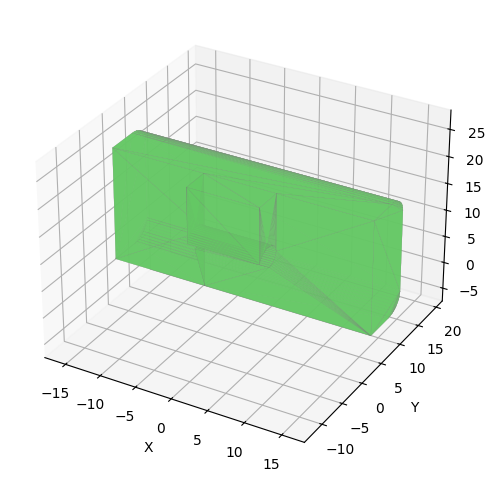

[← Back to Index](../../index.md)

---

# MeshPrep Repair Report

**Generated:** 2026-01-02T18:56:40.888124

## Status: ✅ SUCCESS

## File Information

| Property | Value |
|----------|-------|
| **Input File** | `C:\Users\Dragon Ace\Source\repos\MeshPrep\tests\fixtures\thingi10k\many_small_holes\100072.stl` |
| **Filter Script** | `blender-remesh` |
| **Duration** | 23349.9 ms |
| **Escalation** | Yes (`blender-remesh`) |

## Visual Comparison

<table>
<tr><th>Before (Original)</th><th>After (Repaired)</th></tr>
<tr>
<td></td>
<td></td>
</tr>
</table>

<!-- Markdown fallback for viewers that don't support HTML -->

**Before:** 

**After:** 

## 3D Model Files

Download the STL files to compare in your favorite 3D viewer:

| Model | File | Size Info |
|-------|------|-----------|
| **Before (Original)** | [📥 Download](./models/before.stl) | 180 vertices, 360 faces |
| **After (Repaired)** | [📥 Download](./models/after.stl) | 1,879,700 vertices, 3,759,400 faces |

## Diagnostics Comparison

### Geometry

| Metric | Before | After | Change |
|--------|--------|-------|--------|
| Vertices | 180 | 1,879,700 | 🔺 +1,879,520 (+1044177.8%) |
| Faces | 360 | 3,759,400 | 🔺 +3,759,040 (+1044177.8%) |
| Volume | 11772.6232 | 11772.6693 | +0.0% |
| Surface Area | 4460.7043 | 4456.1252 | -0.1% |
| Bbox Diagonal | 45.8039 | 45.8039 | — |

### Quality Flags

| Flag | Before | After |
|------|--------|-------|
| Watertight | ✅ | ✅ |
| Manifold (is_volume) | ✅ | ✅ |
| Winding Consistent | ✅ | ✅ |

### Defects

| Defect | Before | After |
|--------|--------|-------|
| Boundary Edges | 3 | ❌ 3 |
| Estimated Holes | 1 | ❌ 1 |
| Components | 1 | 1 |
| Degenerate Faces | 0 | ✅ None |
| Euler Characteristic | 0 | 0 |

## Actions Performed

1. `trimesh_basic`
2. `blender_remesh`
3. `fix_normals`
4. `validate`

## Printability Assessment

✅ **Model appears ready for 3D printing!**

The mesh is:
- Watertight (no holes)
- Manifold (valid topology)
- Single component

---

*Report generated by [MeshPrep](https://github.com/DragonAceNL/MeshPrep)*
