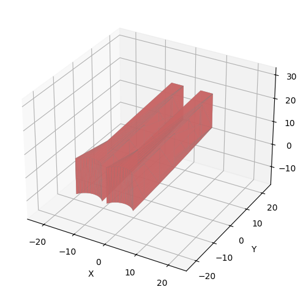
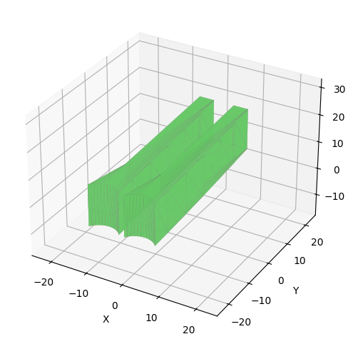

[← Back to Index](../../index.md)

---

# MeshPrep Repair Report

**Generated:** 2026-01-02T18:32:38.432456

## Status: ✅ SUCCESS

## File Information

| Property | Value |
|----------|-------|
| **Input File** | `C:\Users\Dragon Ace\Source\repos\MeshPrep\tests\fixtures\thingi10k\non_manifold\101951.stl` |
| **Filter Script** | `conservative-repair` |
| **Duration** | 22.6 ms |

## Visual Comparison

<table>
<tr><th>Before (Original)</th><th>After (Repaired)</th></tr>
<tr>
<td></td>
<td></td>
</tr>
</table>

<!-- Markdown fallback for viewers that don't support HTML -->

**Before:** 

**After:** 

## 3D Model Files

Download the STL files to compare in your favorite 3D viewer:

| Model | File | Size Info |
|-------|------|-----------|
| **Before (Original)** | [📥 Download](./models/before.stl) | 88 vertices, 168 faces |
| **After (Repaired)** | [📥 Download](./models/after.stl) | 88 vertices, 168 faces |

## Diagnostics Comparison

### Geometry

| Metric | Before | After | Change |
|--------|--------|-------|--------|
| Vertices | 88 | 88 | ➖ +0 (+0.0%) |
| Faces | 168 | 168 | ➖ +0 (+0.0%) |
| Volume | 0.0000 | 7289.6298 | +0.0% |
| Surface Area | 4440.7301 | 4440.7301 | +0.0% |
| Bbox Diagonal | 56.1283 | 56.1283 | — |

### Quality Flags

| Flag | Before | After |
|------|--------|-------|
| Watertight | ✅ | ✅ |
| Manifold (is_volume) | ❌ | ✅ |
| Winding Consistent | ❌ | ✅ |

### Defects

| Defect | Before | After |
|--------|--------|-------|
| Boundary Edges | 3 | ❌ 3 |
| Estimated Holes | 1 | ❌ 1 |
| Components | 2 | 2 |
| Degenerate Faces | 0 | ✅ None |
| Euler Characteristic | 4 | 4 |

## Actions Performed

1. `trimesh_basic`
2. `pymeshfix_repair_conservative`
3. `fix_normals`
4. `validate`

## Printability Assessment

⚠️ **Model may have issues for 3D printing:**

- ⚠️ Mesh has 2 separate components

---

*Report generated by [MeshPrep](https://github.com/DragonAceNL/MeshPrep)*
